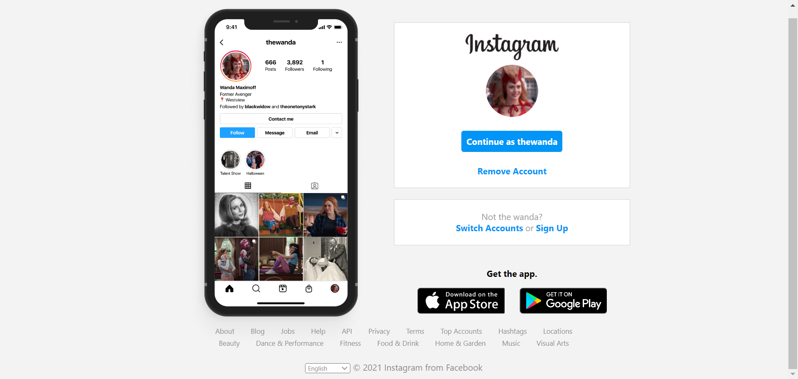

# Página de login do Instagram 

Projeto criado em aula da Digital Inovation One, que tem como desafio reconstruir a página inicial de login do Instagram, tendo como base o conceito sobre CSS utilizando Flexbox, uma metodologia de posicionamento de elementos em tela mais utilizada no mercado assim como conceitos de responsividade.<br>

As telas foram feitas especialmente para esse projeto.


## Tecnologies

- HTML
- CSS

## Run locally

```
# Clone this repository
$ git clone https://github.com/vivianemartini/instagram-dio

# Open folder
$ cd instagram-dio

# Run the app
$ Open live server
```

## Preview



## License

This project is licensed under the MIT License - see the LICENSE.md file for details
